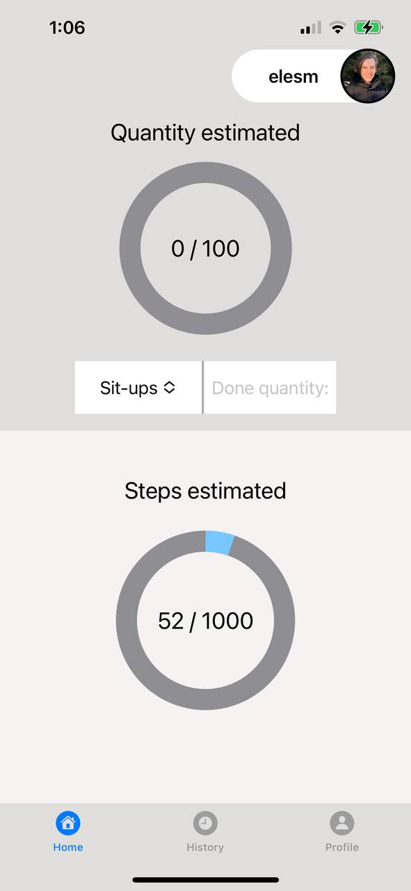
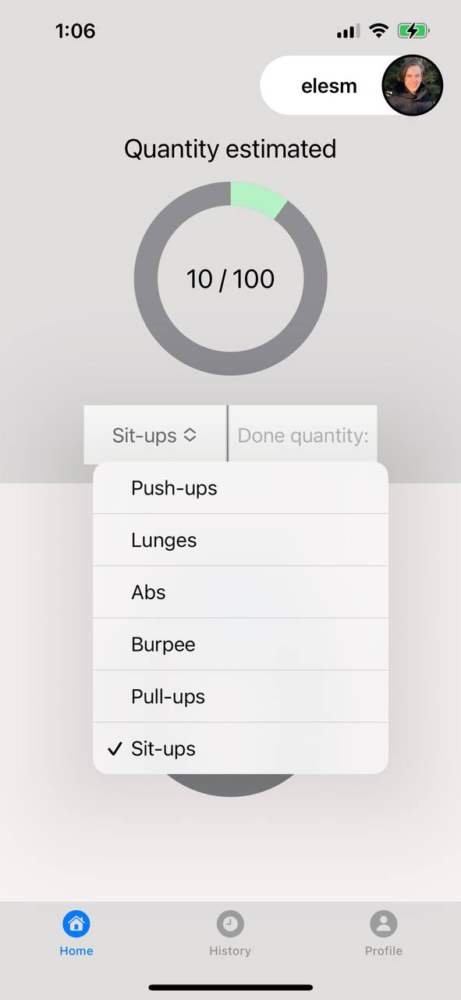
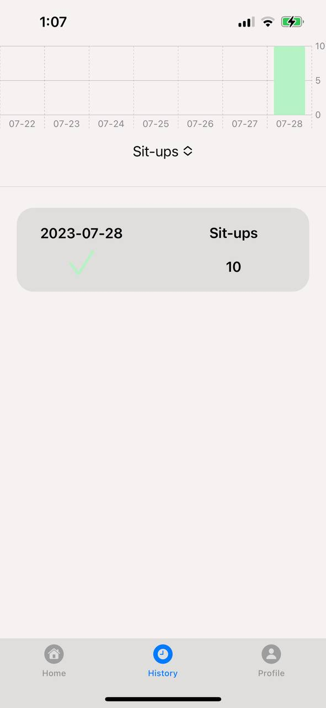
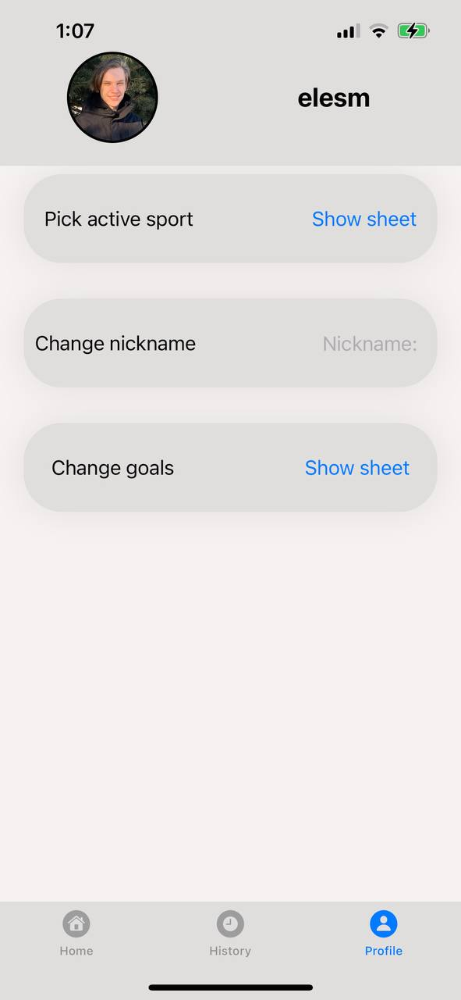
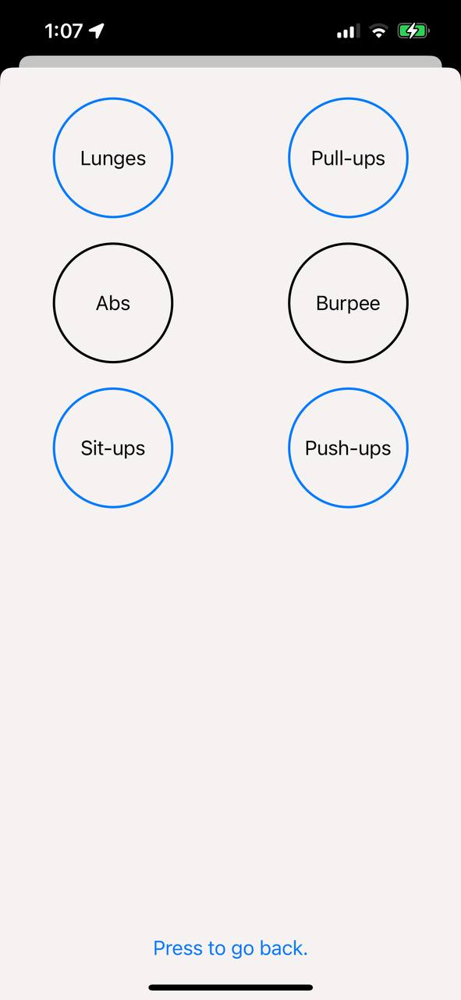
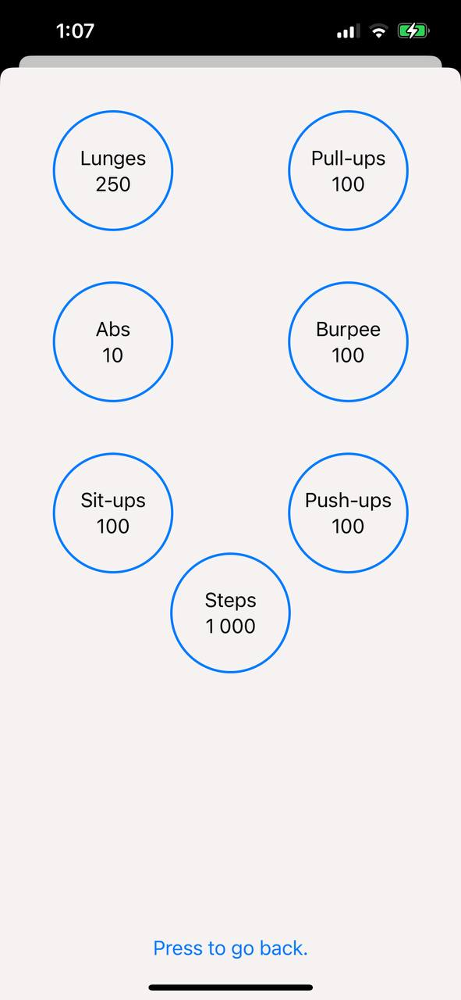
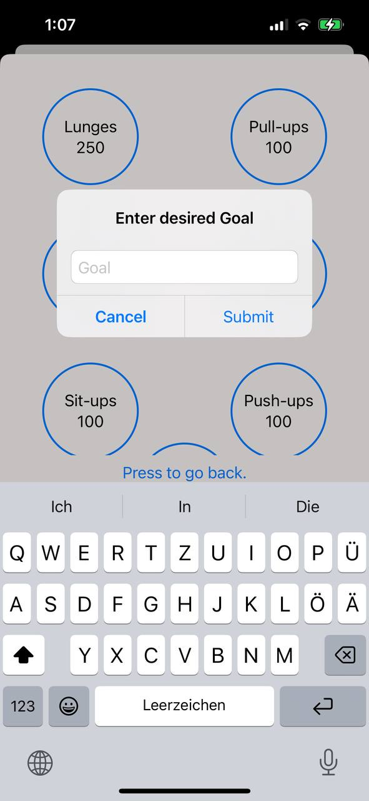
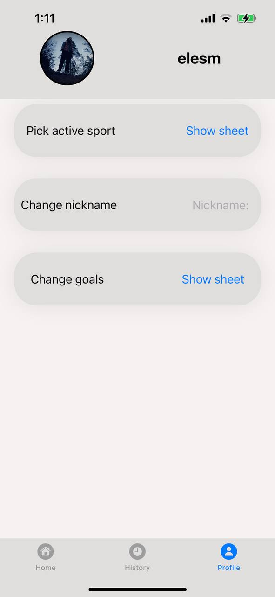

# Exercise-Notizbuch
A Swift written exercise tracking app. It has multiple features to control
client's progress throughout the time and also helps to stay motivated for the future trainings.

## Functionality
- Add progress according to the exercise type you accomplished
- Track goals achievements
- Synchronize with the Apple service to track steps
- List history of the exercises you've done
- Add filters for the history of the exercises
- Change profile image
- Change nickname
- Change pool of sport activities to be presented
- Change goals for the sport activities
- Play sound every time you track new done exercises(might be disabled if)

## Technologies
- Swift
- SwiftUI
- CoreData
- SQLite
- Sketch
- CoreMotion

## Interface
- ### Home screen

- ### History screen

- ### Profile screen

